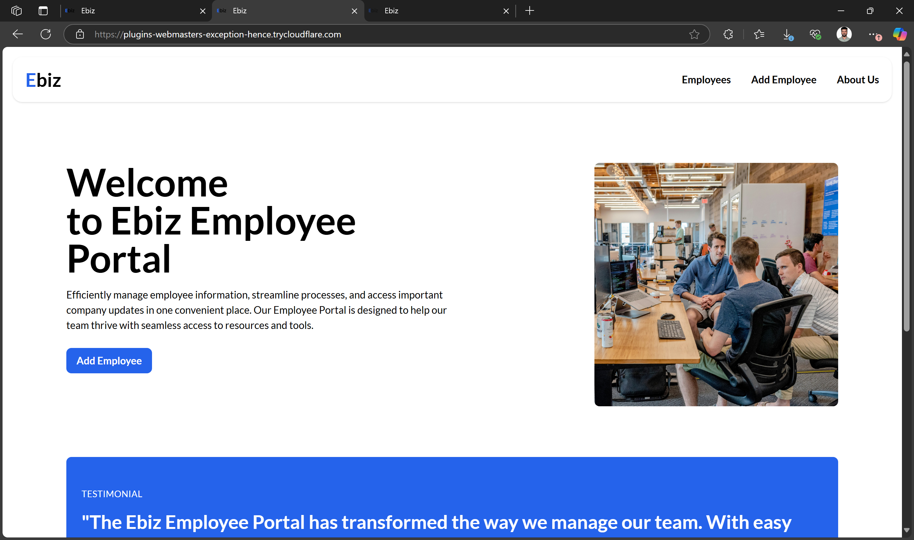
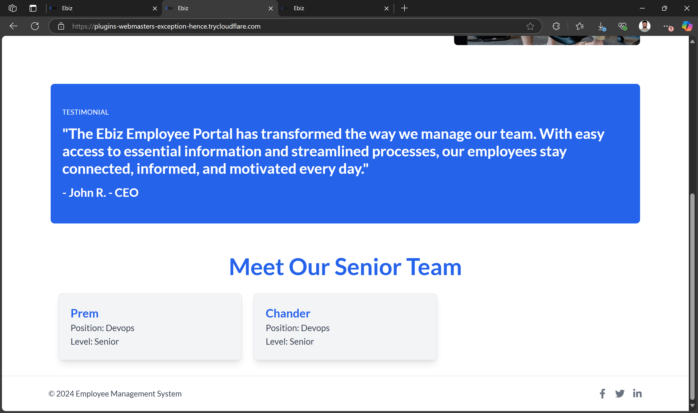
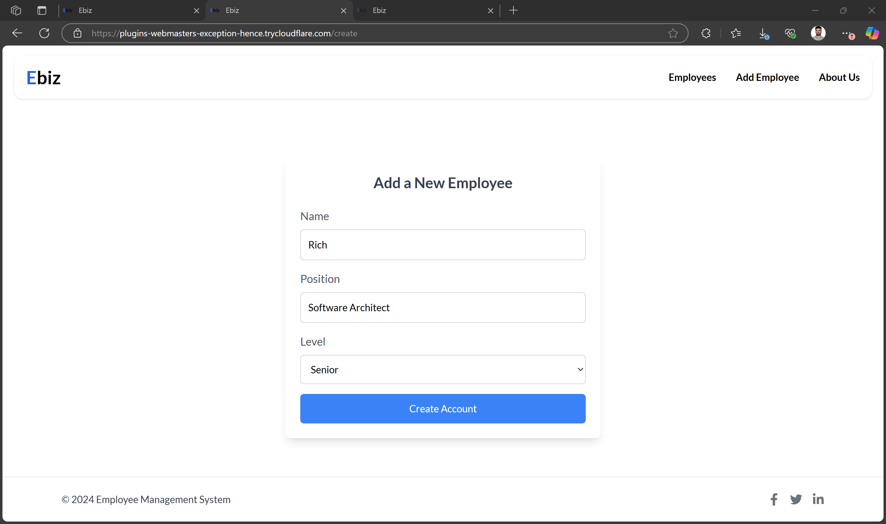
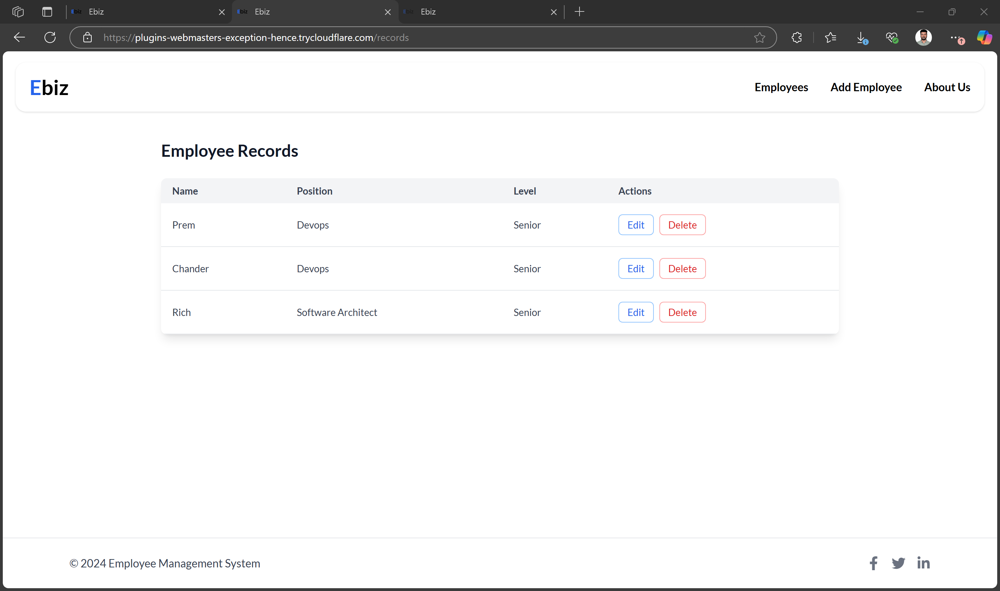

# Employee Management System 

## Project Overview
The Employee Management System is a web application that uses the MERN stack (MongoDB, Express, React, Node.js) to manage employee data. It enables administrators to perform CRUD operations (Create, Read, Update, Delete) and features a React-powered responsive interface. The project is containerized using Docker for consistent deployment and integrated with GitHub Actions for automation.

## Features
- **User Authentication:** Admin and employee login.
- **Employee Management:** Add, edit, and delete employee records.
- **Department and Role Management:** Manage employee departments and roles.
- **Search and Filter:** Search employees by various criteria.
- **Responsive UI:** Built using React for a dynamic user interface.

## Live Demo
You can try the live version of this project by visiting the following link: [text](https://been-preceding-ended-virtual.trycloudflare.com)


## Technologies Used
- **MongoDB:** NoSQL database to store employee information.
- **Express.js:** Web framework for the backend API.
- **React:** Frontend library for a dynamic user interface.
- **Node.js:** JavaScript runtime for the backend.
- **Docker:** Containerization for consistent deployment across environments.
- **Nginx:** Web server to serve the React app in production.
- **GitHub Action:** Automates testing and deployment pipelines.
- **AWS:** For cloud deployment and container management.

## Project Images
![Landing Page] 
![Senior Section] 
![Add Emp] 
![Add Emp] 

## Project Structure

.
├── backend/
│   ├── Dockerfile
│   ├── server.js
│   ├── db/
│   ├── routes/
│   └── .env
├── frontend/
│   ├── Dockerfile
│   └── dist/
├── docker-compose.yml
└── README.md

## Setup Guide

### Step 1: Clone the Repository from GitHub
Clone the repository:

Open your terminal (or Git Bash if you're on Windows) and navigate to the directory where you want to store your project. Then, run the following command to clone your repository:

```bash
git clone (https://github.com/jpremchander/INFO8985-25S-Container-Orchestration)
```
Replace `your-username` with your GitHub username and `employee-mgmt-dockerized` with the name of your repository.

Navigate to the project directory:

After cloning, move into the project directory:

```bash
cd employee-mgmt-dockerized
```

### Step 2: Install Dependencies for the Backend
Navigate to the backend directory (assuming your backend is in a folder called `backend`):

```bash
cd backend
```

Install the backend dependencies:

If you're using npm for backend dependencies, run:

```bash
npm install
```

This will install all the required dependencies specified in the `package.json` file.

### Step 3: Install Dependencies for the Frontend
Navigate to the frontend directory (assuming your frontend is in a folder called `frontend`):

```bash
cd frontend
```

Install the frontend dependencies:

If you're using npm for frontend dependencies, run:

```bash
npm install
```

### Step 4: Run the Backend Locally
Navigate back to the backend directory:

```bash
cd backend
```

Start the backend server:

If you're using npm, run:

```bash
node server.js
```

This will start the backend server. By default, the backend may run on port 5050. You can confirm this in your `server.js` file.

Verify: The backend should now be accessible at [http://localhost:5050](http://localhost:5050).

### Step 5: Run the Frontend Locally
Navigate back to the frontend directory:

```bash
cd ../frontend
```

Start the frontend server:

If you're using npm, run:

```bash
npm run dev
```

This will start the frontend server, which by default will run on port 80.

Verify: The frontend should now be accessible at [http://localhost:80](http://localhost:80).

### Step 6: Dockerize the Backend (Only Backend)
To Dockerize the backend, you'll create a Dockerfile in your backend directory.

## Docker Setup

## Backend Dockerfile

Uses a multi-stage build:

Stage 1: Uses node:18-alpine to install dependencies and build the backend.

Stage 2: Copies build artifacts to a lightweight node:18-alpine image.

Runs the backend server on port 5050.

Runs as a non-root user to enhance security.

Environment variables are injected for configuration and secrets.

## Frontend Dockerfile

Uses multi-stage build:

## Stage 1: Uses node:18-alpine to build the React frontend.

## Stage 2: Uses nginx:alpine to serve the static frontend files.

The built React files are copied into the NGINX default serving directory /usr/share/nginx/html.

## NGINX configuration

Serve static content.

Reverse proxy API calls to the backend server.

Enable gzip compression and caching for better performance.

Exposes port 80 for HTTP access.

## MongoDB Container

Uses official mongo:latest image.

Configured with a secure user and password.

Uses Docker volumes to persist data on the host filesystem, ensuring data survives container restarts.

MongoDB listens on default port 27017 internally (not exposed publicly).

## Docker Compose Configuration

Defines three services: backend, frontend, and mongo.

Creates a dedicated Docker network for isolated communication between services.

## Configures volumes:

mongo-data volume for MongoDB persistent storage.

Optional log volume for backend logs.

## Maps ports:

Frontend accessible at localhost:80.

Backend accessible at localhost:5050 (if needed for direct API testing).

Passes environment variables securely to services, including MongoDB credentials and app configs.

NGINX in frontend service proxies /api requests to backend service for API calls.

## NGINX Configuration Details

Located in the frontend Docker context (nginx.conf).

Serves static React frontend assets.

Proxies API requests to backend to avoid CORS issues.

Listens on port 80.

Uses Alpine-based NGINX image for minimal image size.

Caching and compression enabled for optimized delivery.

## API Endpoints

The backend API exposes:

Method	Endpoint	  Description
POST	/user	    Create a new user entry
GET	    /user/{id}	Retrieve a user by ID

Requests and responses are logged in a file inside the backend container for traceability.

## Security Considerations

* MongoDB user created with limited privileges scoped only to the application database.

* Environment variables used for sensitive data instead of hardcoding credentials.

* Backend and frontend containers run as non-root users.

* Docker networks isolate containers and prevent unnecessary exposure.

* NGINX acts as a reverse proxy, preventing direct access to backend from outside except via allowed routes.

## Data Persistence

* MongoDB data persists using Docker named volumes (mongo-data).

* Volume ensures user data is safe even if MongoDB container restarts or is recreated.

* Backend logs can optionally be persisted via volumes for audit purposes.

## Testing the API with Postman

* Set the base URL to http://localhost:5050.

* Create User (POST /user):

* Headers: Content-Type: application/json

Body:

{
  "firstName": "Leon",
  "lastName": "Jebastian"
}
Get User by ID (GET /user/{id}):

Replace {id} with actual user ID returned by POST.

Responses return JSON objects with user data or status messages.

You can verify logs inside the backend container to confirm requests.

## Running the Application

To start the entire application stack locally:

docker-compose up --build
Frontend accessible at http://localhost

Backend API accessible at http://localhost:5050 (optional direct access)

MongoDB runs in the background with persistent data storage.

## Exposing via Cloudflare Tunnel

To expose the frontend app publicly without a domain:


cloudflared tunnel --url http://localhost:80

This generates a public HTTPS URL tunneled securely to your local machine.

# Summary of Files
File	                           Purpose
backend/Dockerfile	          Multi-stage build for backend API server
frontend/Dockerfile	          Multi-stage build for React + NGINX
frontend/nginx.conf	          NGINX config for serving frontend & proxy
docker-compose.yml	          Orchestrates backend, frontend, mongo containers
.env	                      Environment variables for app & database
README.md	                  Project Documentation

