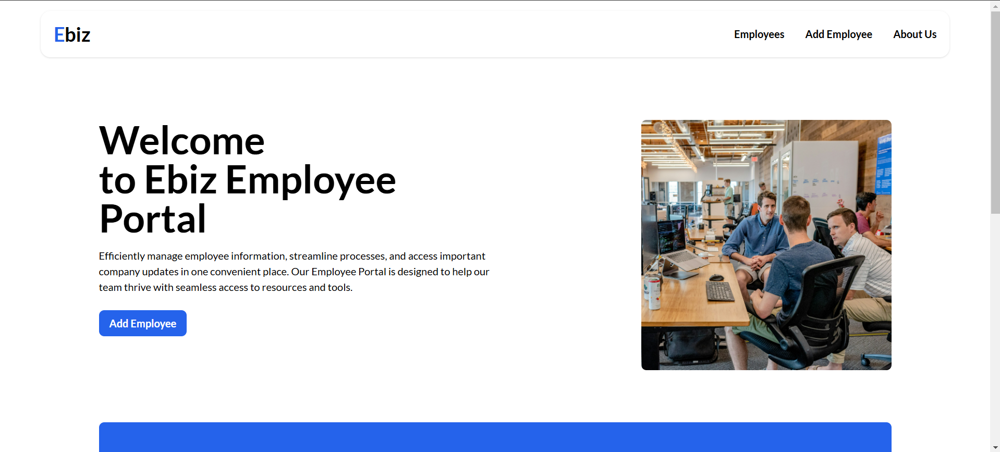

# Employee Management System 

## Project Overview
The Employee Management System is a web application that uses the MERN stack (MongoDB, Express, React, Node.js) to manage employee data. It enables administrators to perform CRUD operations (Create, Read, Update, Delete) and features a React-powered responsive interface. The project is containerized using Docker for consistent deployment and integrated with GitHub Actions for automation.

## Features
- **User Authentication:** Admin and employee login.
- **Employee Management:** Add, edit, and delete employee records.
- **Department and Role Management:** Manage employee departments and roles.
- **Search and Filter:** Search employees by various criteria.
- **Responsive UI:** Built using React for a dynamic user interface.

## Live Demo
You can try the live version of this project by visiting the following link: [Live Demo](#)


## Technologies Used
- **MongoDB:** NoSQL database to store employee information.
- **Express.js:** Web framework for the backend API.
- **React:** Frontend library for a dynamic user interface.
- **Node.js:** JavaScript runtime for the backend.
- **Docker:** Containerization for consistent deployment across environments.
- **Nginx:** Web server to serve the React app in production.
- **GitHub Action:** Automates testing and deployment pipelines.
- **AWS:** For cloud deployment and container management.

## Project Images



## Setup Guide

### Step 1: Clone the Repository from GitHub
Clone the repository:

Open your terminal (or Git Bash if you're on Windows) and navigate to the directory where you want to store your project. Then, run the following command to clone your repository:

```bash
git clone https://github.com/your-username/employee-mgmt-dockerized.git
```
Replace `your-username` with your GitHub username and `employee-mgmt-dockerized` with the name of your repository.

Navigate to the project directory:

After cloning, move into the project directory:

```bash
cd employee-mgmt-dockerized
```

### Step 2: Install Dependencies for the Backend
Navigate to the backend directory (assuming your backend is in a folder called `backend`):

```bash
cd backend
```

Install the backend dependencies:

If you're using npm for backend dependencies, run:

```bash
npm install
```

This will install all the required dependencies specified in the `package.json` file.

### Step 3: Install Dependencies for the Frontend
Navigate to the frontend directory (assuming your frontend is in a folder called `frontend`):

```bash
cd frontend
```

Install the frontend dependencies:

If you're using npm for frontend dependencies, run:

```bash
npm install
```

### Step 4: Run the Backend Locally
Navigate back to the backend directory:

```bash
cd backend
```

Start the backend server:

If you're using npm, run:

```bash
node server.js
```

This will start the backend server. By default, the backend may run on port 5050. You can confirm this in your `server.js` file.

Verify: The backend should now be accessible at [http://localhost:5050](http://localhost:5050).

### Step 5: Run the Frontend Locally
Navigate back to the frontend directory:

```bash
cd ../frontend
```

Start the frontend server:

If you're using npm, run:

```bash
npm run dev
```

This will start the frontend server, which by default will run on port 3000.

Verify: The frontend should now be accessible at [http://localhost:3000](http://localhost:3000).

### Step 6: Dockerize the Backend (Only Backend)
To Dockerize the backend, you'll create a Dockerfile in your backend directory.

#### Step-by-Step:
1. Navigate to your backend folder.
2. Create a Dockerfile in the backend directory:

```dockerfile
FROM node:16

WORKDIR /app

COPY package*.json ./

RUN npm install

COPY . .

EXPOSE 5050

CMD ["node", "server.js"]
```

3. Build the Docker image:
Run the following command in the terminal (from the backend directory):

```bash
docker build -t my-backend .
```

4. Run the Docker container:
After building the image, run the backend container:

```bash
docker run -p 5050:5050 my-backend
```

This will run your backend on port 5050.

### Step 7: Multi-stage Build for Backend
A multi-stage build allows you to create smaller images by having multiple stages in your Dockerfile.

#### Step-by-Step:
1. Modify your Dockerfile to use multi-stage builds:

```dockerfile
# Stage 1: Build
FROM node:18-alpine AS build
WORKDIR /app
COPY package*.json ./
RUN npm install
COPY . .

# Stage 2: Production
FROM node:18-alpine
WORKDIR /app
COPY --from=build /app /app
ENV NODE_ENV=production
EXPOSE 5050
CMD ["node", "server.js"]
```

2. Build the Docker image with multi-stage:

```bash
docker build -t my-backend-multistage .
```

3. Run the container:

```bash
docker run -p 5050:5050 my-backend-multistage
```

### Step 8: Push Image to Docker Hub (Only Backend)
To push the image to Docker Hub, follow these steps:

1. Log in to Docker Hub in your terminal:

```bash
docker login
```

2. Tag your image for Docker Hub:
Assuming your Docker Hub username is `username` and the image name is `my-backend`:

```bash
docker tag my-backend username/my-backend:latest
```

3. Push the image:
Push the tagged image to Docker Hub:

```bash
docker push username/my-backend:latest
```

### Step 9: Pull the NGINX Image from Docker Hub
To serve the React app, pull the latest official NGINX image from Docker Hub:

```bash
docker pull nginx:latest
```

### Step 10: Build the React Frontend (if not already built)
If you haven't already built the React app, navigate to the frontend directory and build the React app:

```bash
cd path/to/your/frontend
npm run build
```

This will create a `build/` directory in your frontend project that contains all the static files.

### Step 11: Volume Map React Build Files to NGINX
Now, we’ll run the NGINX container and map the volume to serve the React app's static files.

Run the NGINX container and map volumes:

```bash
docker run -d -p 3002:80 \
    -v ./employee-mgmt-dockerized/frontend/public/build:/usr/share/nginx/html \
    -v ./employee-mgmt-dockerized/frontend/nginx/nginx.conf:/etc/nginx/nginx.conf \
    nginx
```

Verify that the NGINX container is running by visiting [http://localhost](http://localhost) in your browser. Your React app should now be served by NGINX.

### Step 12: Optional - Run Both Backend and Frontend with Docker Compose
If you want to run both the backend (Node.js) and frontend (NGINX) using Docker Compose, you can create a `docker-compose.yml` file to manage both services.

Create a `docker-compose.yml` file in your project root directory with the following content:

```yaml
version: '3'

services:
    backend:
        image: emp-backend
        build: ./backend
        ports:
            - "5050:5050"

    frontend:
        image: nginx
        volumes:
            - ./frontend/build:/usr/share/nginx/html
            - ./frontend/nginx/nginx.conf:/etc/nginx/nginx.conf
        ports:
            - "3000:80"
```

#### Step-by-Step:
1. Navigate to the project’s root directory.
2. Run the Docker Compose services:

```bash
docker-compose up --build
```

This will start both the backend and the frontend in their respective containers. Your backend will be available at [http://localhost:5050](http://localhost:5050), and your frontend will be available at [http://localhost:3000](http://localhost:3000).

### Step 13: Setup GitHub Action to Push Images to Docker Hub

To automate pushing Docker images of the backend and frontend to Docker Hub upon a push event in your GitHub repository, use the following GitHub Actions workflow. This ensures consistent builds and deployments from your repository.

#### GitHub Actions Workflow: `backend-docker-push.yml`

Create a GitHub Actions workflow file in `.github/workflows/backend-docker-push.yml`:

```yaml
name: Backend and Frontend Docker Push

on: push

jobs:
    test-backend:
        runs-on: ubuntu-latest
        steps:
            - name: Checkout repository
                uses: actions/checkout@v3
            
            - name: Install backend dependencies
                run: |
                    cd backend
                    npm install

    test-frontend:
        runs-on: ubuntu-latest
        steps:
            - name: Checkout repository
                uses: actions/checkout@v3

            - name: Install frontend dependencies
                run: |
                    cd frontend
                    npm install

    docker-push:
        needs: 
            - test-backend 
            - test-frontend
        runs-on: ubuntu-latest
        steps:
            - name: Checkout repository
                uses: actions/checkout@v3

            - name: Build Docker images
                run: |
                    docker-compose build

            - name: Log in to Docker Hub
                run: |
                    echo "${{ secrets.DOCKER_PASSWORD }}" | docker login -u "${{ secrets.DOCKER_USERNAME }}" --password-stdin

            - name: Push Backend Image to Docker Hub
                run: |
                    docker tag emp-backend ${{ secrets.DOCKER_USERNAME }}/emp-backend:latest
                    docker push ${{ secrets.DOCKER_USERNAME }}/emp-backend:latest

            - name: Push Frontend Image to Docker Hub
                run: |
                    docker tag nginx ${{ secrets.DOCKER_USERNAME }}/emp-frontend:latest
                    docker push ${{ secrets.DOCKER_USERNAME }}/emp-frontend:latest
```

#### Steps Explained:

- **Trigger:** This workflow is triggered on any push to the main branch. Adjust the branch name as needed.
- **Test Backend:** Installs and verifies the backend dependencies. [Optional]
- **Test Frontend:** Installs and verifies the frontend dependencies. [Optional]
- **Docker Build and Push:** After successfully testing, Docker images are built using `docker-compose` and pushed to Docker Hub using your saved credentials.

#### Setting Up Secrets:

To store your Docker Hub credentials securely in the GitHub repository:

1. Go to your repository's **Settings > Secrets and variables > Actions**.
2. Add the following secrets:
     - `DOCKER_USERNAME`: Your Docker Hub username.
     - `DOCKER_PASSWORD`: Your Docker Hub password or access token.

#### Verifying Workflow:

1. Commit and push the `backend-docker-push.yml` file to your repository.
2. Check the **Actions** tab in your GitHub repository to monitor the workflow's execution.
3. Once complete, the backend and frontend Docker images will be available on Docker Hub under your account, tagged as `latest`.

### Step 14: GitHub Action to Push Docker Images to ECR

This workflow pushes the backend Docker image to Amazon ECR.

### GitHub Actions Workflow: `backend-docker-push-to-ecr.yml`

```yaml
name: Push Backend Docker Image to ECR

on:
    push:
        branches:
            - main  # Adjust the branch name if needed

jobs:
    build-and-push:
        runs-on: ubuntu-latest

        steps:
            - name: Checkout repository
                uses: actions/checkout@v3

            - name: Set up Docker Buildx
                uses: docker/setup-buildx-action@v2
                # Allows for advanced Docker Build features

            - name: Login to AWS ECR
                run: |
                    aws configure set aws_access_key_id ${{ secrets.AWS_ACCESS_KEY_ID }}
                    aws configure set aws_secret_access_key ${{ secrets.AWS_SECRET_ACCESS_KEY }}
                    aws configure set default.region ${{ secrets.AWS_DEFAULT_REGION }}
                    aws ecr get-login-password --region ${{ secrets.AWS_DEFAULT_REGION }} | docker login --username AWS --password-stdin ${{ secrets.AWS_ACCOUNT_ID }}.dkr.ecr.${{ secrets.AWS_DEFAULT_REGION }}.amazonaws.com
                # Logs into AWS ECR using AWS credentials stored in GitHub Secrets

            - name: Build Docker Image
                run: |
                    docker-compose build backend
                # Builds the Docker image for the backend from docker-compose.

            - name: Tag Docker Image
                run: |
                    docker tag backend:latest ${{ secrets.AWS_ACCOUNT_ID }}.dkr.ecr.${{ secrets.AWS_DEFAULT_REGION }}.amazonaws.com/emp-backend:latest
                # Tags the built backend Docker image.

            - name: Push Backend Image to ECR
                run: |
                    docker push ${{ secrets.AWS_ACCOUNT_ID }}.dkr.ecr.${{ secrets.AWS_DEFAULT_REGION }}.amazonaws.com/emp-backend:latest
                # Pushes the backend Docker image to ECR.
```

### Explanation:

- This workflow is triggered on a push to the main branch.
- It logs into AWS using credentials stored in GitHub Secrets (AWS Access Key, Secret Key, AWS Region, and Account ID).
- It builds the backend Docker image and pushes it to an ECR repository (emp-backend).

### Setting up AWS Secrets:

Go to your repository’s **Settings > Secrets and variables > Actions** and add:

- `AWS_ACCESS_KEY_ID`: Your AWS access key.
- `AWS_SECRET_ACCESS_KEY`: Your AWS secret key.
- `AWS_ACCOUNT_ID`: Your AWS account ID.
- `AWS_DEFAULT_REGION`: The AWS region (e.g., us-west-2).

### Step 15: GitHub Action for Dockerfile Vulnerability Scanning with Trivy

This workflow scans your Dockerfiles for security vulnerabilities using Trivy.

### GitHub Actions Workflow: `docker-vulnerability-scan.yml`

```yaml
name: Scan Docker Images for Vulnerabilities

on:
    push:
        branches:
            - main  # Adjust the branch name if needed

jobs:
    vulnerability-scan:
        runs-on: ubuntu-latest

        steps:
            - name: Checkout repository
                uses: actions/checkout@v3

            - name: Install Trivy
                run: |
                    sudo apt-get update
                    sudo apt-get install -y wget
                    wget https://github.com/aquasecurity/trivy/releases/download/v0.29.2/trivy_0.29.2_Linux-64bit.deb
                    sudo dpkg -i trivy_0.29.2_Linux-64bit.deb
                # Installs Trivy on the runner

            - name: Scan Dockerfile for Vulnerabilities
                run: |
                    trivy fs --severity HIGH,CRITICAL --exit-code 1 --no-progress .
                # Scans the repository's Dockerfiles for vulnerabilities. It exits with a non-zero code if high/critical vulnerabilities are found.
```

### Explanation:

- The workflow scans the Dockerfiles for vulnerabilities using Trivy.
- If any critical or high vulnerabilities are found, it will fail the pipeline (exit-code 1).

### Step 16: GitHub Action to Deploy Backend and Frontend to EC2

This workflow deploys your backend and frontend Docker containers to an EC2 instance using SSH.

### GitHub Actions Workflow: `deploy-to-ec2.yml`

```yaml
name: Deploy to EC2

on:
    push:
        branches:
            - main  # Trigger on push to main

jobs:
    deploy:
        runs-on: ubuntu-latest

        steps:
            - name: Checkout repository
                uses: actions/checkout@v3

            - name: Set up SSH for EC2
                uses: webfactory/ssh-agent@v0.5.3
                with:
                    ssh-private-key: ${{ secrets.EC2_SSH_PRIVATE_KEY }}
                # Configures SSH to communicate with EC2 using the private key stored in GitHub secrets.

            - name: Copy Backend Docker Image to EC2
                run: |
                    ssh -o StrictHostKeyChecking=no ec2-user@${{ secrets.EC2_PUBLIC_IP }} << 'EOF'
                        docker pull ${{ secrets.AWS_ACCOUNT_ID }}.dkr.ecr.${{ secrets.AWS_DEFAULT_REGION }}.amazonaws.com/emp-backend:latest
                        docker-compose -f /path/to/your/backend/docker-compose.yml up -d
                    EOF
                # Pulls the latest Docker image from ECR and deploys the backend to EC2 using `docker-compose`.

            - name: Copy Frontend Docker Image to EC2
                run: |
                    ssh -o StrictHostKeyChecking=no ec2-user@${{ secrets.EC2_PUBLIC_IP }} << 'EOF'
                        docker pull ${{ secrets.AWS_ACCOUNT_ID }}.dkr.ecr.${{ secrets.AWS_DEFAULT_REGION }}.amazonaws.com/emp-frontend:latest
                        docker-compose -f /path/to/your/frontend/docker-compose.yml up -d
                    EOF
                # Pulls the latest Docker image for the frontend and deploys it to EC2.
```


### Explanation:

- This workflow uses SSH to connect to your EC2 instance and deploys the backend and frontend Docker images pulled from ECR.
- It assumes the `docker-compose.yml` file is present on the EC2 instance, which defines how to run the containers for both backend and frontend.

### Setting up EC2 SSH Secrets:

In your repository's **Settings > Secrets and variables > Actions**, add the following secrets:

- `EC2_SSH_PRIVATE_KEY`: Your private SSH key to access the EC2 instance.
- `EC2_PUBLIC_IP`: The public IP address of your EC2 instance.
